# 🌱 GrowGenius  
**Smart Farming and Crop Advisory Platform**

GrowGenius is a full-stack smart agriculture platform that integrates **crop prediction**, **weather forecasting**, **disease detection**, and **nearby store locator** features using AI/ML and open APIs. Developed to assist farmers with data-driven insights and recommendations.

---

## 🧠 Problem Statement

**Empowering farmers with AI-driven insights and accessible crop care tools.**

> Goal: Develop an all-in-one intelligent farming assistant to enhance crop productivity, predict yield, monitor weather, detect diseases, and assist with decision-making.

---

## 🌟 Key Features

- 🌾 **Crop & Fertilizer Recommendation System**  
  Input-based crop suggestions using ML models trained on soil parameters and environmental data.

- ☁️ **Live Weather Dashboard**  
  Real-time and forecast data using OpenWeatherMap API with regional insights.

- 🧪 **Disease Detection via ML Models**  
  Upload images of infected crops to get disease predictions and treatment suggestions.

- 🗺️ **Nearby Agri Stores Locator**  
  Google Maps API powered map view showing nearest agri-service providers.

- 📊 **Smart Farming Dashboard**  
  Visual insights, charts, and stats on farming data for better planning.

- 💬 **Integrated Chatbot**  
  Quick help for basic farming queries through a simple, interactive bot.

---

## 📱 Screenshots

| Home Page | Mission & Vision | Features | Footer |
|-----------|------------------|----------|--------|
| 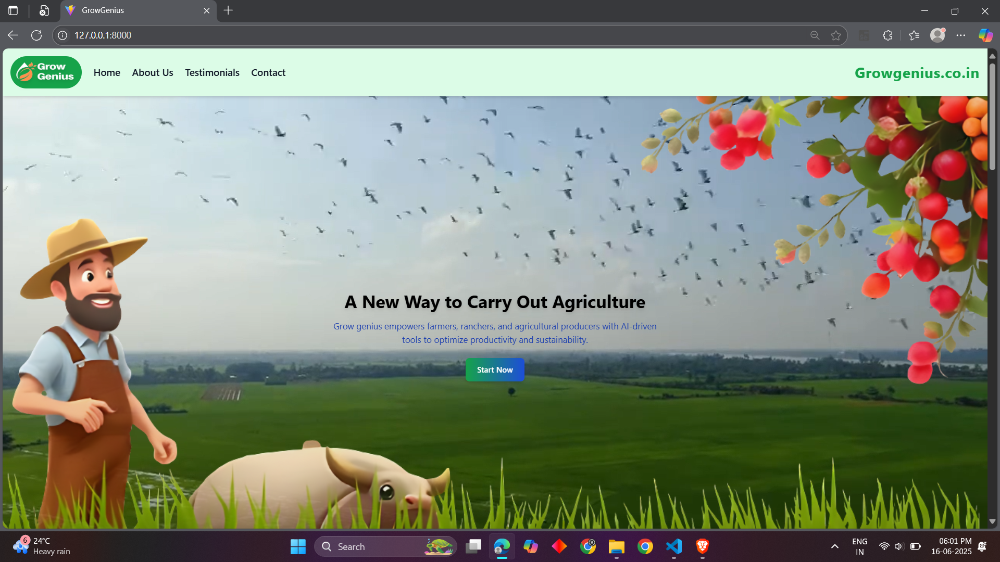 | 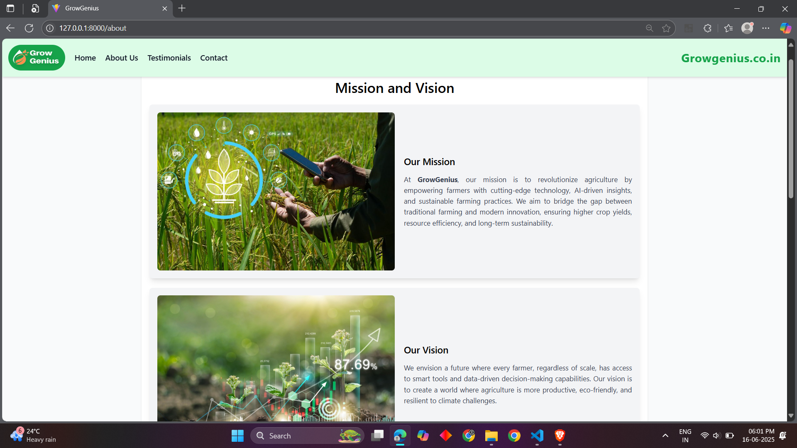 | 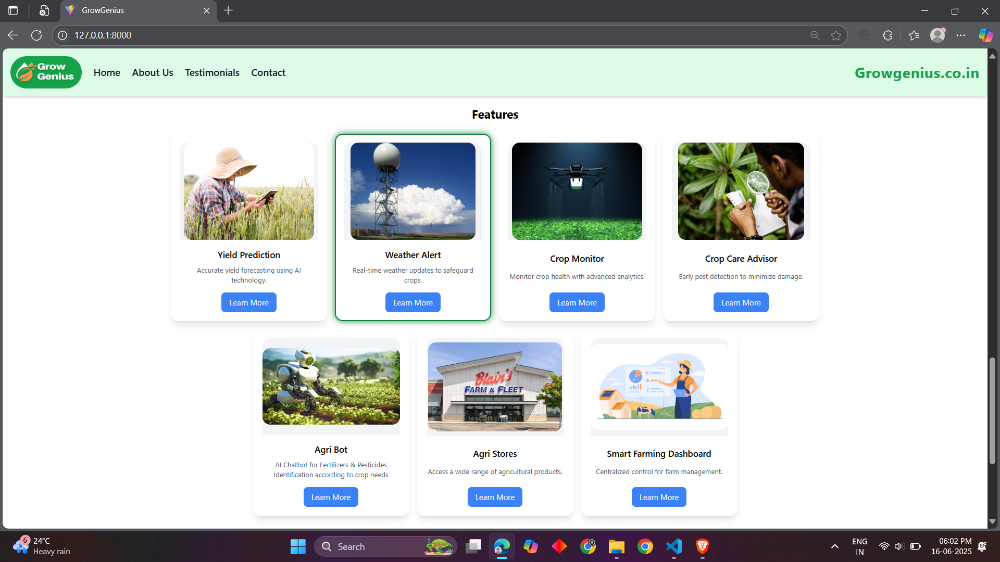 |  |

| Crop Advisory | Disease Detection | Yield Prediction | Temperature Dashboard |
|---------------|-------------------|------------------|------------------------|
| 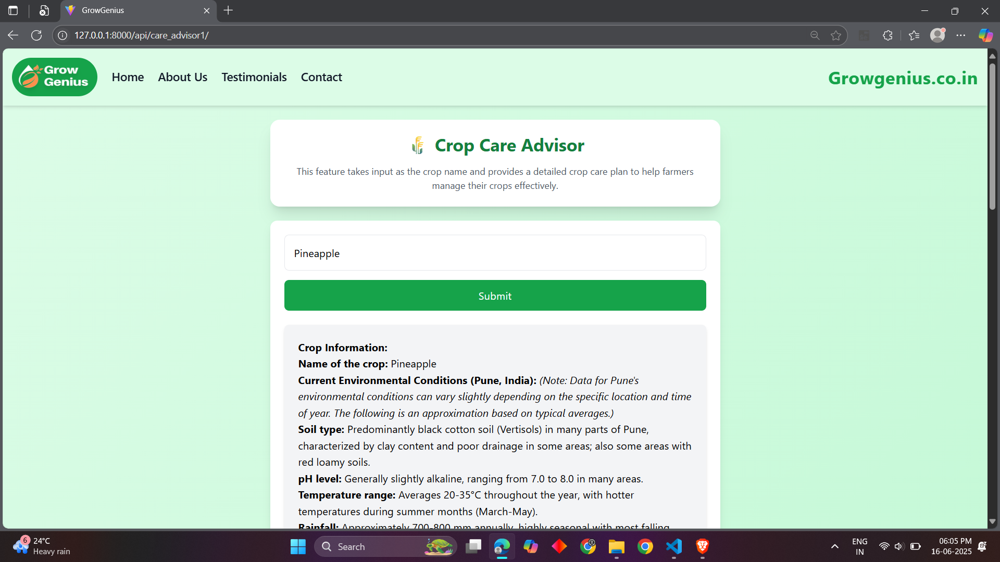 | 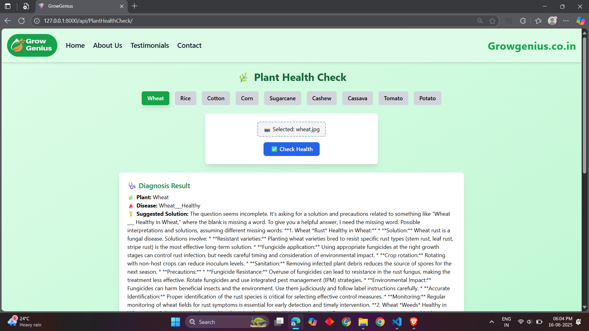 | 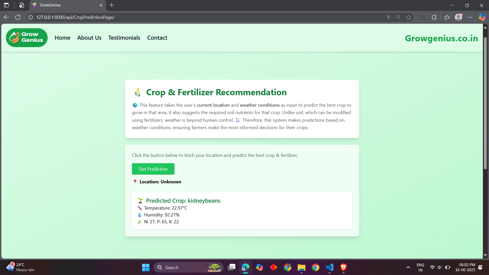 | 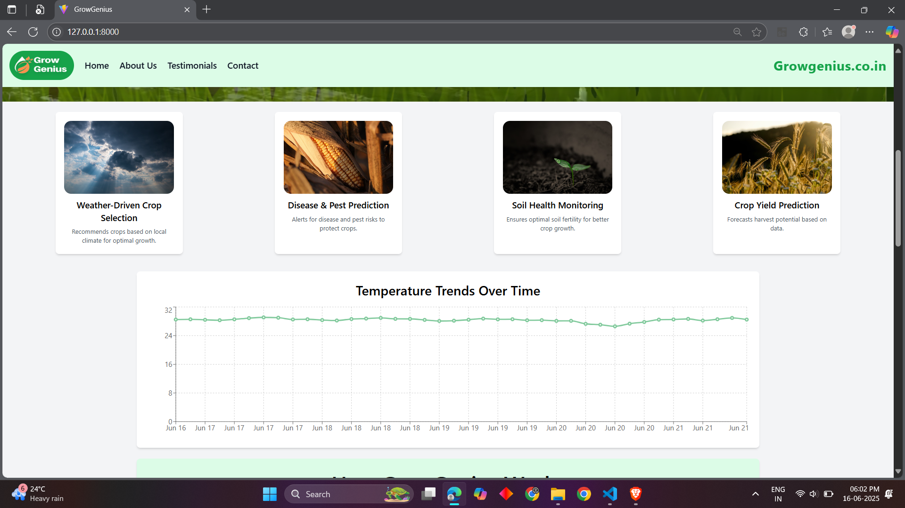 |

| Weather Dashboard | Weather Stats | Dashboard Visuals | Smart Farming Dashboard |
|-------------------|----------------|--------------------|--------------------------|
| 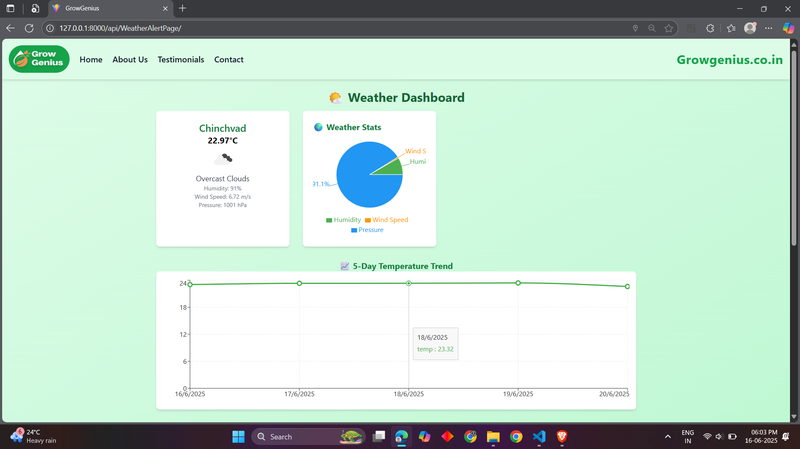 | 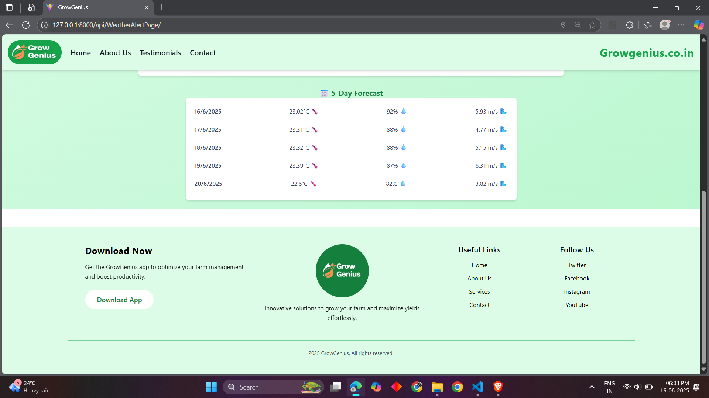 | 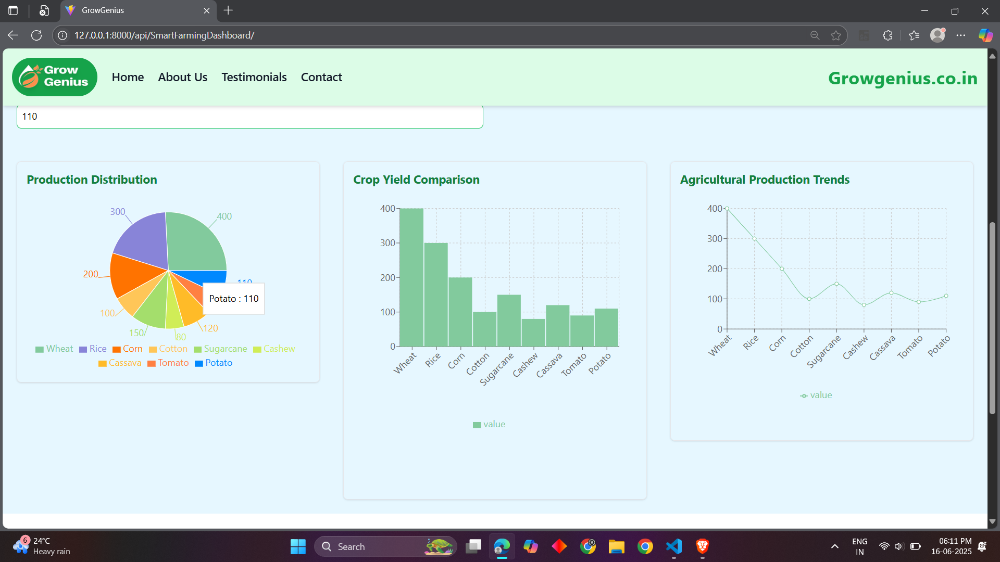 | 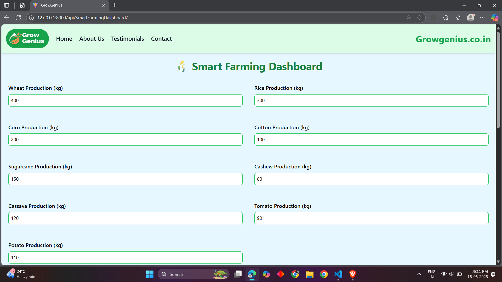 |

| Nearby Stores Map | Store List | Testimonials | Contact Us |
|-------------------|------------|--------------|------------|
| 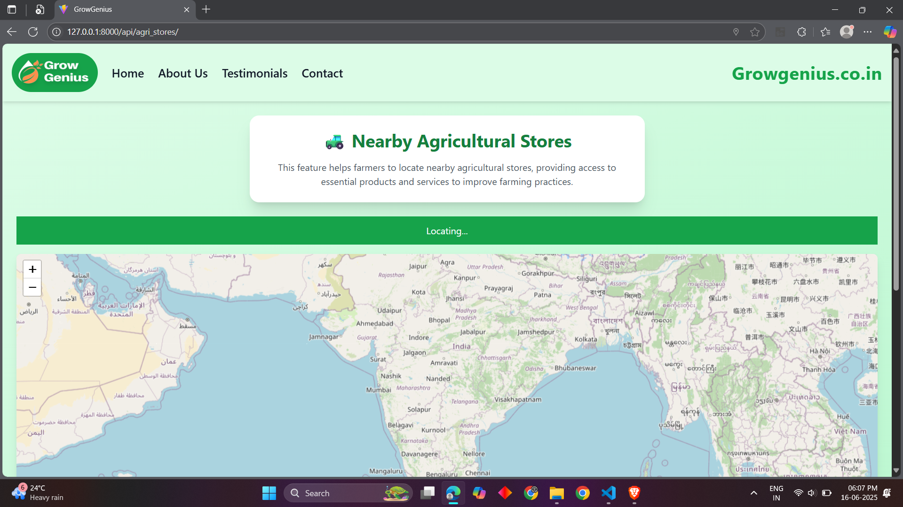 | 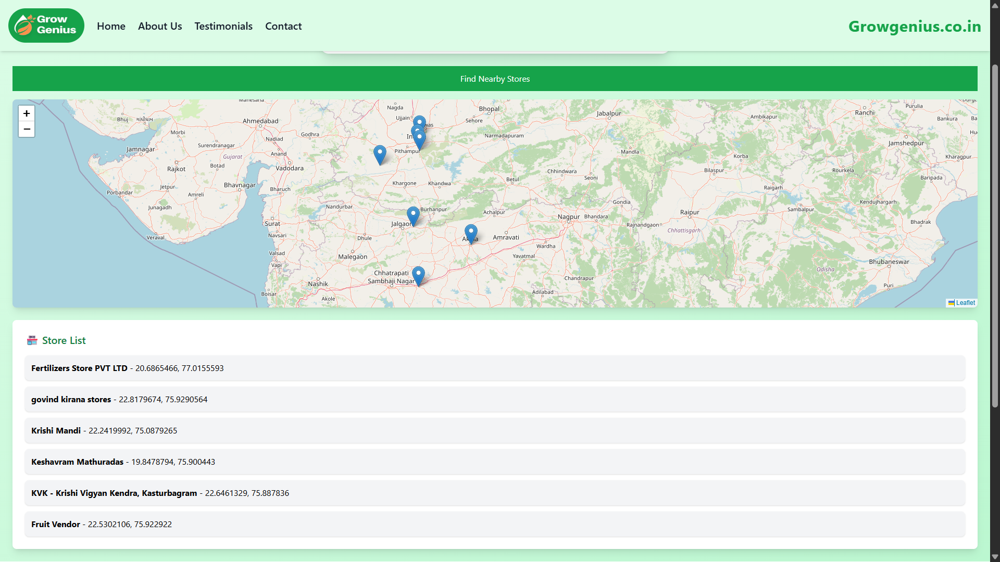 | 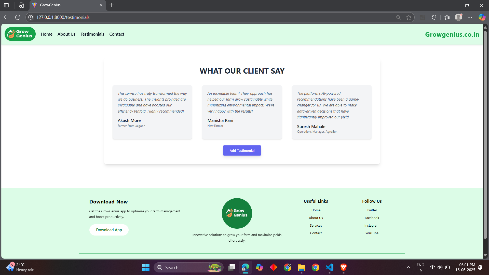 | 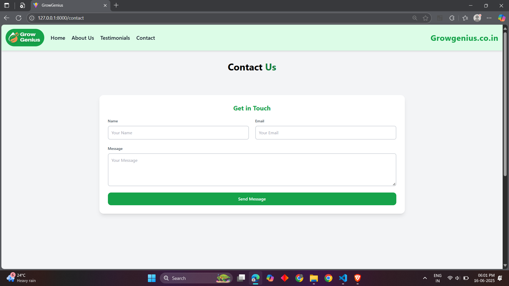 |

| Chatbot Home | Chat Window |
|--------------|-------------|
| 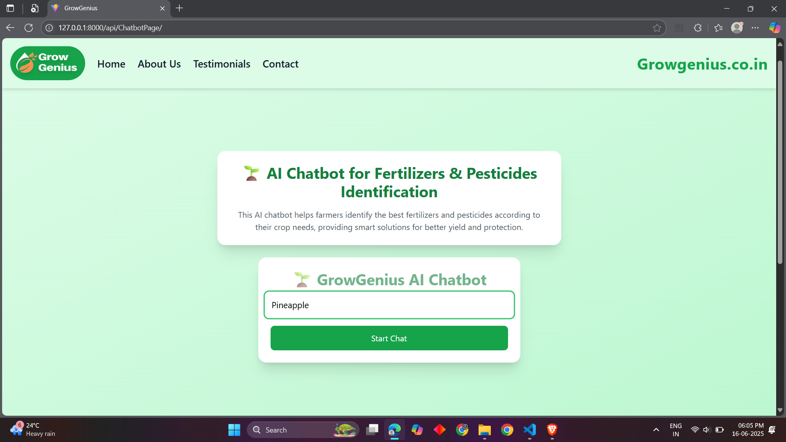 | 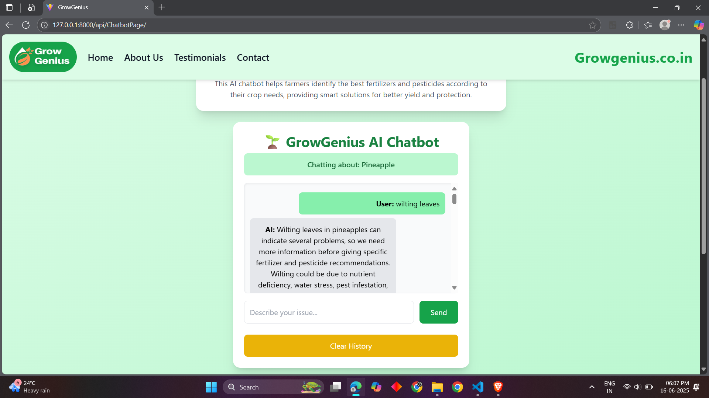 |

---

> 🎯 **Note**: This is a showcase repository for portfolio purposes. The backend models and production code remain private. For demo or collaboration inquiries, feel free to reach out via [LinkedIn](https://www.linkedin.com/in/am-vyavhare/) or [GitHub](https://github.com/am-vyavhare).
